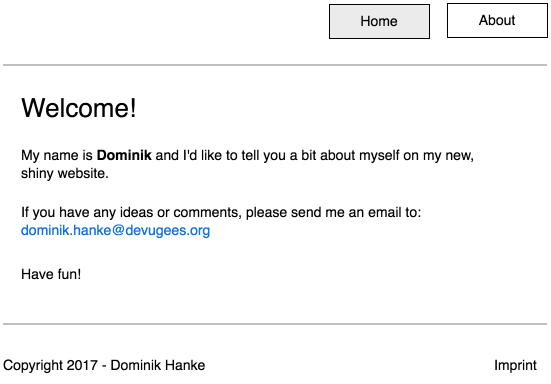
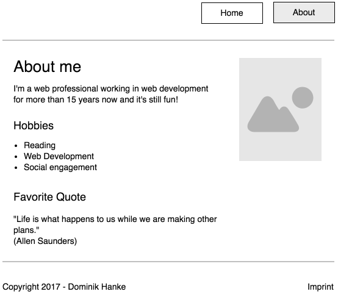

# CSS basic task

This is an exercise for HTML &amp; CSS basics. You'll need to remember what the basic HTML structure looks like, how to use floats, image, links and lists.

# Tasks

1.  Create the following page layouts, that you see as mockups below. Feel free to be creative and add additional styling, but **only** after you finished the basic version.

# Mockups

