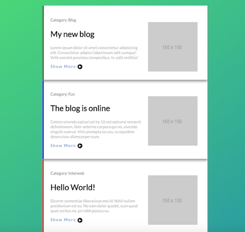
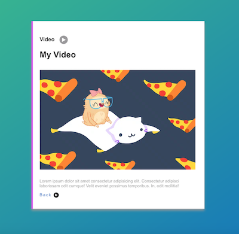

# Create a blog with semantic elements and css
You will create a simple blog page with 3 articles linked to a single post

### Topics
HTML: HTML5 Semantic Elements  
CSS: border, box-shadow, color, background, linear-gradient, opacity, font, z-index

You should
  - The article's bottom and top should overlaps a bit
  - Link the articles to the video section
  - Have fun

### Design

Articles list



Single




### Bonus
The background is:
```
linear-gradient(325deg, #006ac5, #49e46a);
```

Image placeholder is:
```
http://via.placeholder.com/150x150
```

Font: Lato from Google Fonts
