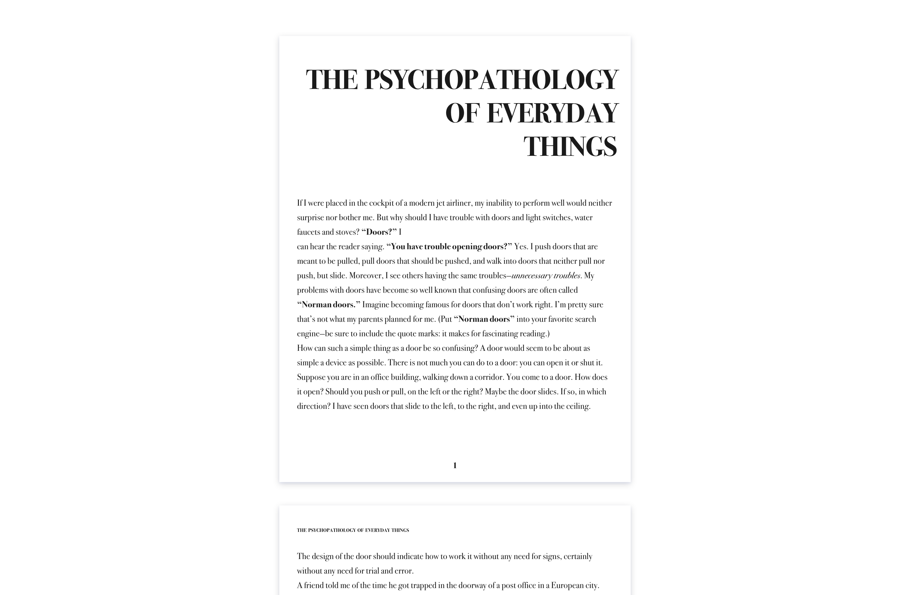

# From Markdown to HTML template

## Preview

## Task

Use the text that you can find in the [text.md](./text.md) create a website and copy the text and markup. Make sure to use semantic tags. In the markdown page breaks are shown with `---`.
You will need to read the text in order to markup it correctly. Analyze the picture in detail!

Font: Arapey
