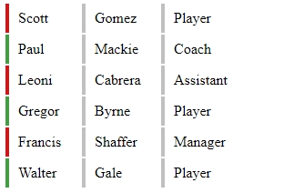
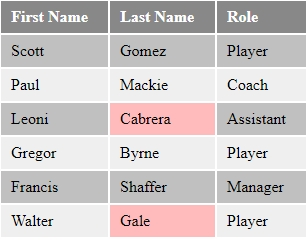

# CSS Pseudo Classes

## Tasks

Create 2 tables with different layouts and CSS definitions, using the `:first-child`, `:last-child`, `:nth-child` and `:not` pseudo classes.

## Mockups

### Table 1

### Table 2

## Used Colors

### Table 1

  

    

    
#c0c0c0

  

  

    

    
#cc181b

  

  

    

    
#449d45

  

<strong>Table 2</strong>

  

    

    
#888888

  

  

    

    
#c0c0c0

  

  

    

    
#efefef

  

  

    

    
#ffbbbb

  

