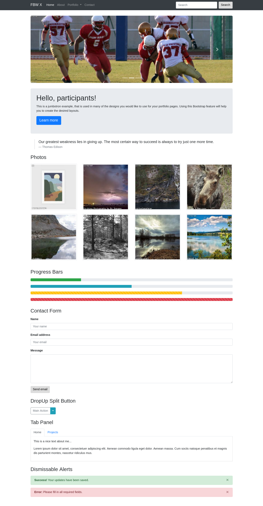

# Bootstrap

This is an exercise for [Bootstrap 4](http://getbootstrap.com/docs/4.1/getting-started/introduction/) and the most common used features for basic websites.

# Tasks

## Important Note

Don't forget to change IDs to your own naming, as you should never copy code from the Bootstrap documentation without reading and modifying. Read - Understand - Use.

## Components

Create the following components as you can see below:

1. A **navbar** with some links for navigation and a search form
1. A **carousel** with minimum 3 slides, showing sports or landscapes
1. A **jumbotron** with a modified styling
1. A **photo gallery** with responsive changing columns (1, 3, 4)
1. A **progress bar** demo with different colors, stripes and animation
1. A **form** with labels, input fields and a button
1. A **drop up** button that is splitted
1. A **tab panel** with individual styling
1. A **dismissable alert** in minimum 2 colors

# Mockup



# Needed tools

## SCSS compiler (node-sass-chokidar)

How to run the SCSS compiler on your terminal:

```bash
# Change to the directory of your exercise
cd ~/Development/010-bootstrap-framework

# Run it once
node-sass-chokidar scss --output css

# Watch for file changes
node-sass-chokidar --watch scss --output css
```

## Live server

```bash
# Change to the directory of your exercise
cd ~/Development/010-bootstrap-framework/

# Run the server, that reload automatically on change
live-server
```
