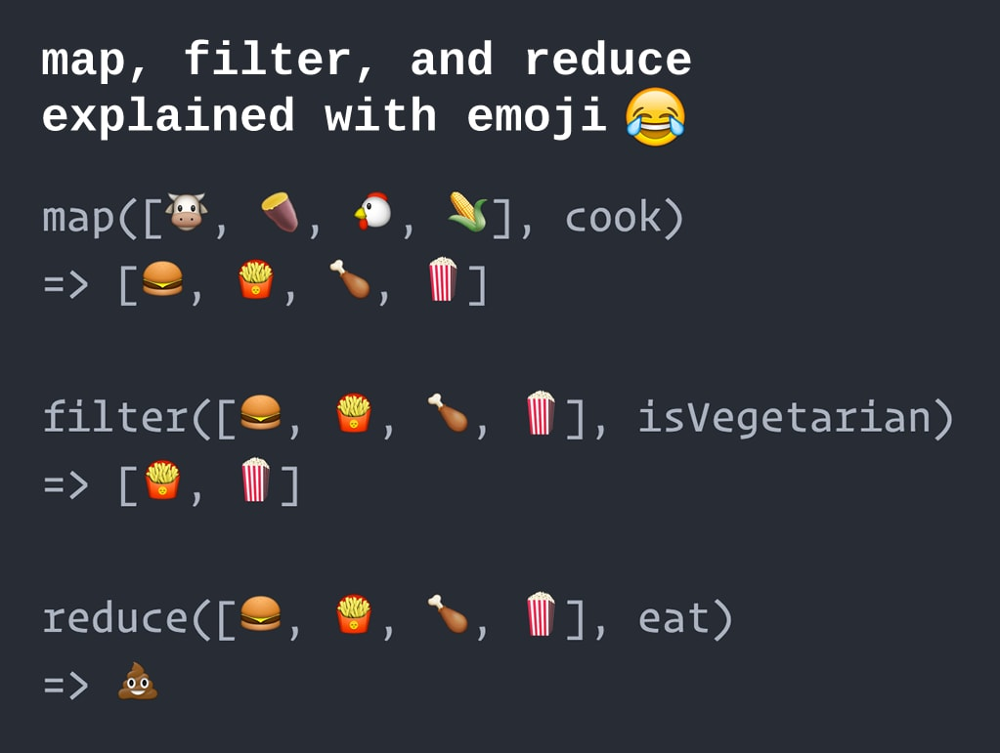

# create map, filter, reduce functions from image

Transform the examples on the picture in real code.



### Starting poing:
```
const food = ['cow', 'potato', 'chicken', 'corn']
var cook = (food) => {
  switch ...  
}
map(food => cook)
```
