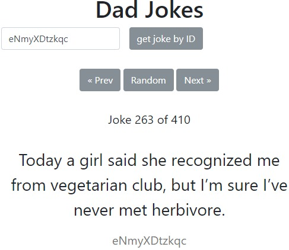

# Dad jokes API

## Exercise

The famous Dad Jokes have their own [JSON Api](https://icanhazdadjoke.com), that will be used for this exercise.

__You have to create:__

- A form to search for a joke by a given ID
- A joke display with it's number, text and ID
- A joke navigation with "prev", "random" and "next"

__Expected behavior:__

1. When the user enters a number and clicks on the submit button, the Dad Jokes API is used to retrieve the information about a specific joke with that ID.
1. When the user clicks on the "Random Choice" button, the Dad Jokes API is used to get the information about a random joke. You can use the endpoint (/search) with a limit of 1 to retrieve the maximum value (number of comics) for the range of random numbers.
1. No matter which button or form submit the user chooses, you have to build or update the following display elements:
    - The button to the previous joke
    - The button to the next joke
    - The number of the comic
    - The text of the comic
    - The ID of the comic
1. The buttons "Prev" and "Next" should be disabled, if there is no older or newer joke.
1. There should not be any page reload. Use XHR requests only!

## Mockup

Your result could look like the following demo, that shows all needed parts of the application. Feel free to add some more creative styling, but please get it working first.  

## Template

https://codepen.io/noreading/pen/eVKoGp

## Solution

https://codepen.io/noreading/full/QQeKpZ/