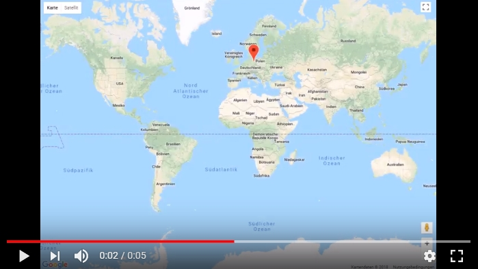

# IP Location + Google Maps API

## Exercise

You will create a full-width Google Map that zooms into the closest position that we can retrieve by checking the [IP Geolocation API](https://ipinfo.io/products#core-api).

__You have to create:__

- A class that loads the GeoData from the API
- A class that:
    - loads the default map
    - handles the geolocation data
    - adds an infoWindow with details
    - sets a default map marker (red)
    - centers the map to the IP location
    - zooms into the center of the map

 __Important:__

 You need to get your own Google Maps API key, from the [Google Developer Console](https://console.developers.google.com).

## Mockup

Your result could look like in the following demo video, that shows all needed parts of the application. Feel free to add some more creative styling, but please get it working first.

Click the thumbnail to see the video.  

## Template

https://codepen.io/noreading/pen/LeOwzd/

## Solution

https://codepen.io/noreading/full/VyyZjO/