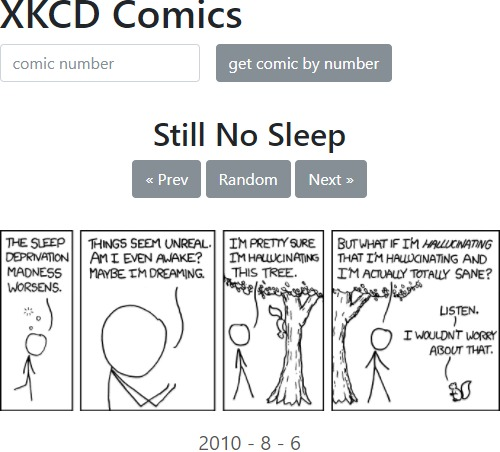

# XKCD Comic API

## Exercise

The famous XKCD comics have their own [JSON Api](https://xkcd.com/json.html), that will be used for this exercise.

__You have to create:__

- A form to search for a comic by a given ID
- A comic display with title, navigation and date
- A comic navigation with "prev", "random" and "next"

__Expected behavior:__

1. When the user enters a number and clicks on the submit button, the xkcd API is used to retrieve the information about a specific comic with that ID.
1. When the user clicks on the "Random Choice" button, the xkcd API is used to get the information about a random comic. You can use the endpoint (/info.0.json) to retrieve it's number, so that you know the maximum value for the range of random numbers.
1. No matter which button or form submit the user chooses, you have to build or update the following display elements:
    - The button to the previous comic
    - The button to the next comic
    - The title of the comic
    - The image of the comic
    - The date of the comic
1. The buttons "Prev" and "Next" should be disabled, if there is no older or newer comic.
1. There should not be any page reload. Use XHR requests only!
1. As there's a special problem (we will talk about later) with the xkcd API on CodePen, please use the template that already includes a workaround for you.

## Mockup

Your result could look like the following demo, that shows all needed parts of the application. Feel free to add some more creative styling, but please get it working first.  

## Template

https://codepen.io/noreading/pen/paKYqq

## Solution

https://codepen.io/noreading/full/bYzYBN/