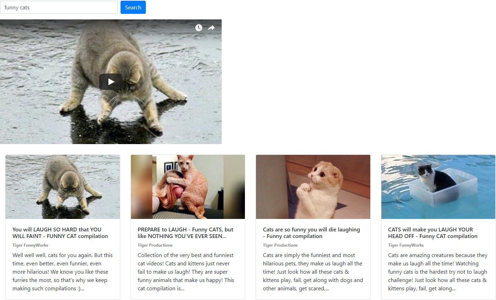
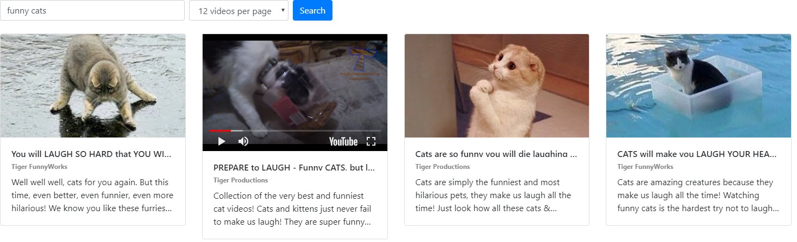

jkj# Youtube Video API

## Exercise

YouTube offers the [Youtube Data API](https://developers.google.com/youtube/v3/docs/) and a [YouTube Player API](https://developers.google.com/youtube/iframe_api_reference?hl=en) that we can use to search for videos and load them into a single video player on click.

__You have to create:__

- A form to search for videos by any string
- A video display with cards containing
    - The video thumbnail
    - The video title
    - The video channel
    - The video description
- A pagination with "Prev" and "Next"

__Expected behavior:__

1. When the user enters a string and clicks on the submit button, the YouTube Data API is used to retrieve the information about all matching videos.
1. When the user clicks on a single video in the list, the video should be loaded into a video player above the result list.
1. When the user clicks on a single video in the list and the player already exists, the page should scroll up and the player should get updated (and do not create it from scratch every time).
1. The buttons "Prev" and "Next" should be disabled, if there is no other page back or forth.
1. There should not be any page reload. Use XHR requests only!

__Advanced version:__

If you're finished with the exercise and would like to add advanced features, you can add:
- A select to switch the amount of videos shown per page.
- An inline player for the videos inside of the cards.
- The behavior that only one player is existing on the page at once. If another video is clicked, destroy the current video player and then create a new one, to save performance as many players can kill the browser.

## Mockup

Your result could look like the following demo, that shows all needed parts of the application. Feel free to add some more creative styling, but please get it working first.  

__Regular version:__

__Advanced version:__

## Template

https://codepen.io/noreading/pen/eympaQ/

## Solution

Regular:  
https://codepen.io/noreading/full/gobPOm/

Advanced:  
https://codepen.io/noreading/full/baNeYB/
