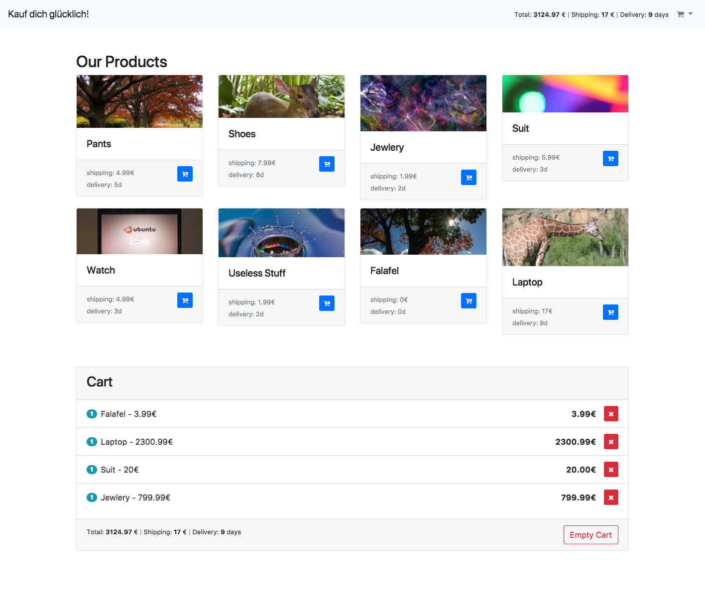

# A nice and easy shopping cart
Open the `index.html` in a browser.  
It saves clicked items in the localStorage, calculates the total amount, shipping costs and delivery time.

uglyfile the index.js with `uglifyjs -c -m -p 'bare_returns' -o index.js assets/javascript/index.js` to get the uglified one which is required in index html
