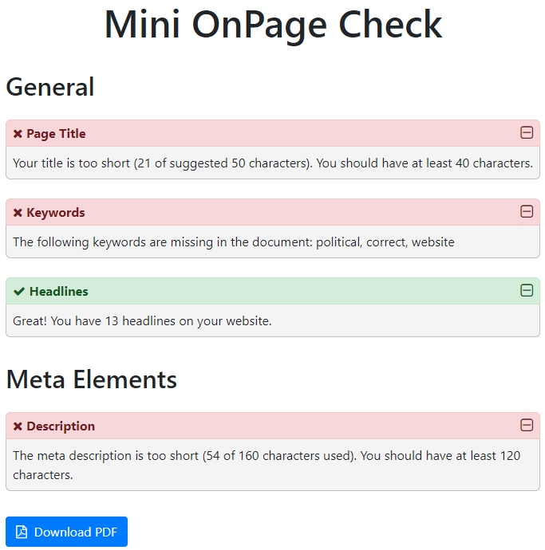

# React OnPage Check

This is a simple OnPage check application built as a basic exercise to use [React](https://reactjs.org/). It will crawl a website, using a CORS proxy and the result can be exported as PDF.

# Demo

