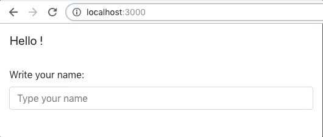

# Transform a non redux app to use redux

At the moment the dataflow is from Settings up to App down to Header down to Nav. With Redux we dont need to step over App and Header and go directly from Settings to Nav.

