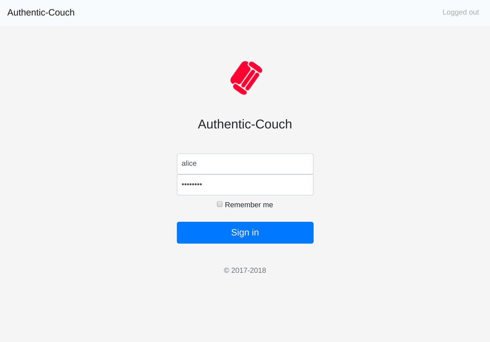
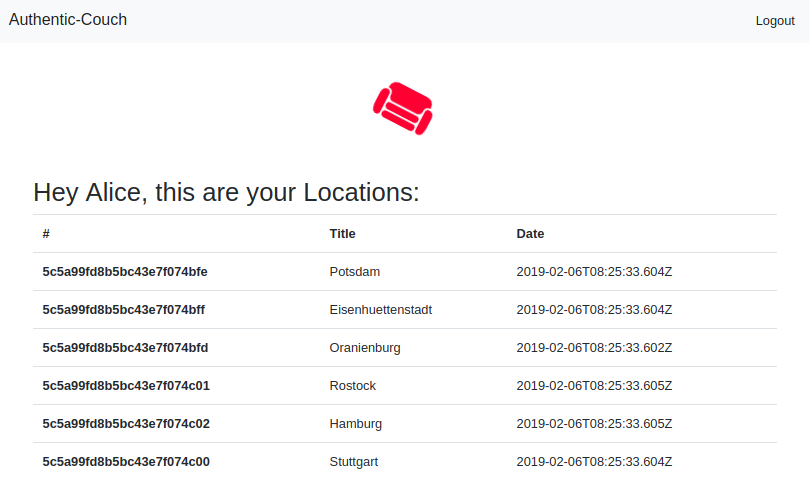

# Authentic-Couch | user-facing web-frontend for JWT-API backend

Install and run the client `cd frontend && npm install && npm start`  
Install and run the API `cd backend && npm install && npm start`

Api on `http://localhost:8080`

You can login on   
`http://localhost:8080/api/authenticate`  
with   
`name: alice, password: password`

Login view

Logged in view

