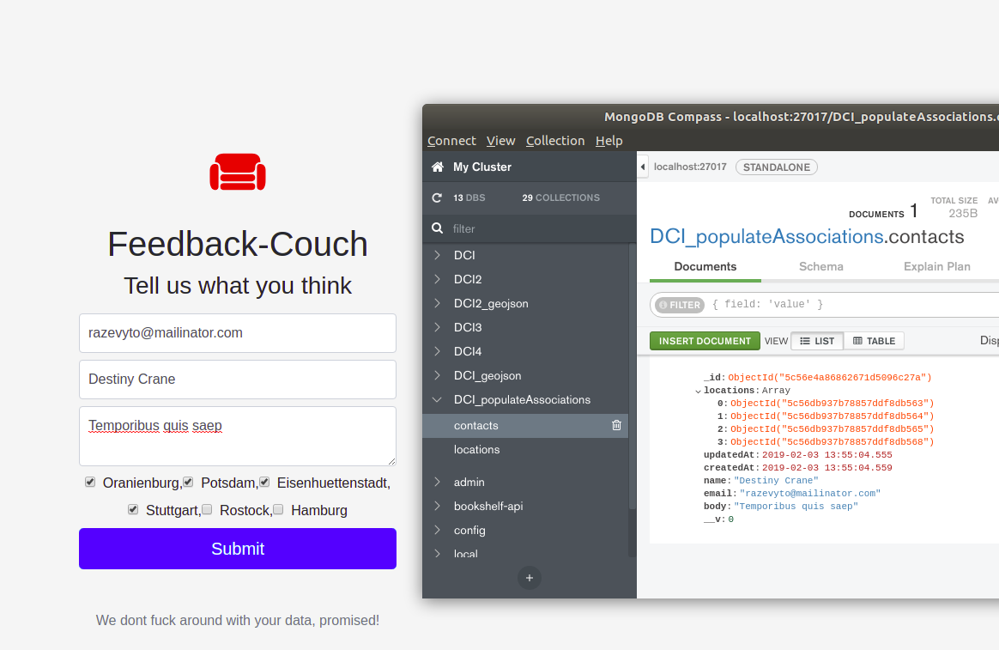

# MongoDB Population

Static HTML that holds a form with variable locations. 
- Make a initial fetch for the locations, generate some frontend html checkboxes
- Submit the form with a array of location IDs
- Save a contact with a foreign field containing the IDs of the locations 

