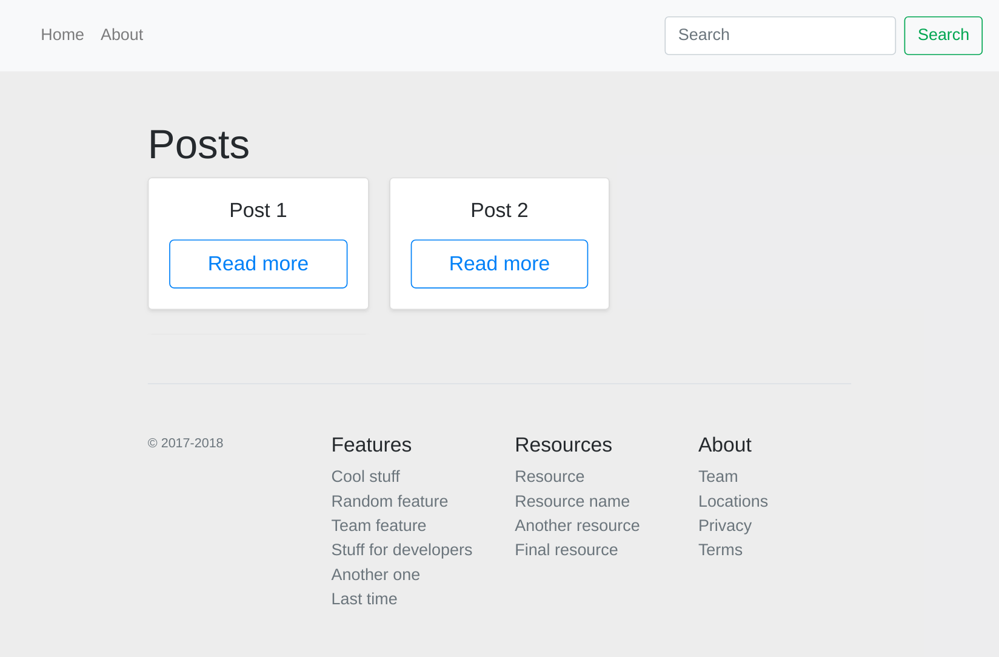
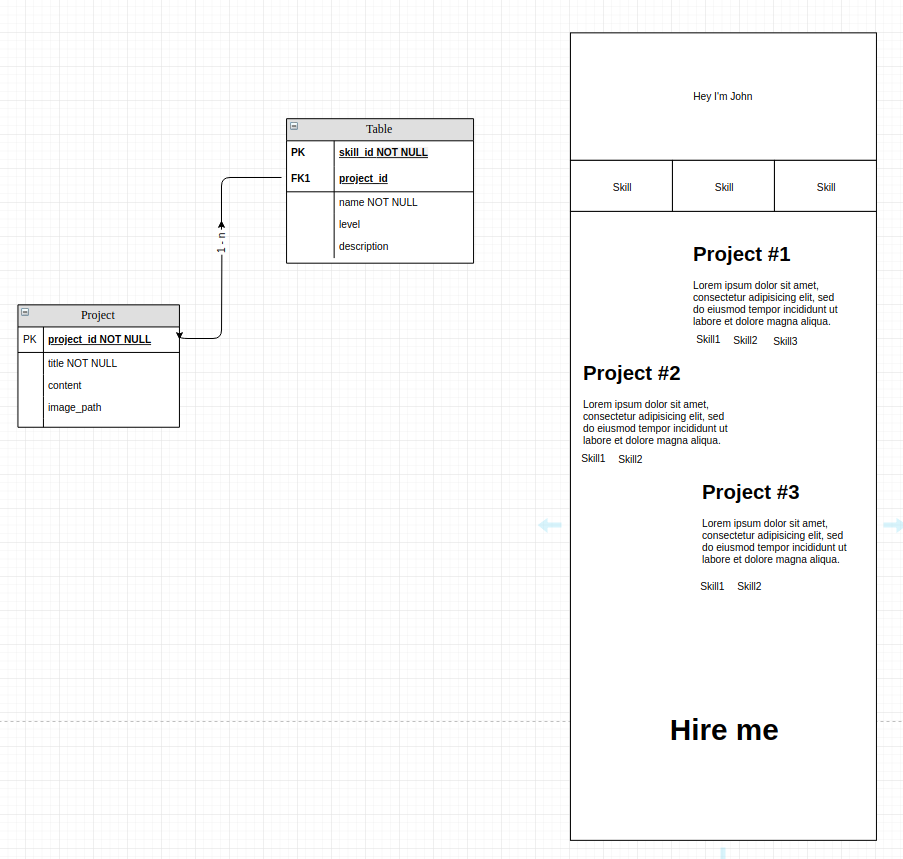

# SSSSG - super simple static site generator
[Live-version](https://fbw-10.github.io/minimalistic-portfolio-static-site-generator/)

Reads pug files in `src/views`, feeds the data from `src/data` and generates static html files in `docs`.

Put your posts in 
`build.js` in `const posts = {..`  

Put you css/js in   
`src/assets`

To build the pug files run `node build.js`

Database model

