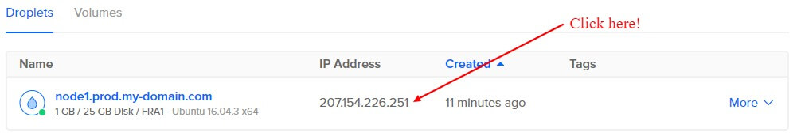
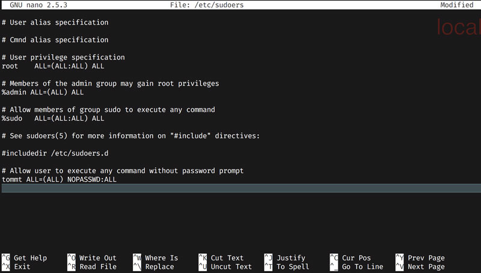

# Add a new user

## Get the IP address

Copy the IP address of your new droplet from the [droplet management](https://cloud.digitalocean.com/droplets) page. If you click on the IP address it will automatically get copied to your clipboard.

## Login to your server

The commands of this tutorial can be run in any terminal on Ubuntu or Mac computers. For Windows you need a linux shell like Git Bash (comes together with Git) or [Cygwin](http://www.cygwin.com/).

Use SSH to login:
<pre>
ssh root@<b>{ip address}</b>
</pre>

## Add a new user

It's common to use your real name as username, so that it's easy to remember. If you want to manage a server with multiple users it can be a benefit to use concatenated names like "dhanke" for "Dominik Hanke" as multiple people could have the same first name.

If you're managing the server alone, the easiest thing to remember is your first name.

### Create the user and change the password

<pre>
useradd -m -s /bin/bash <b>{username}</b>
passwd <b>{username}</b>
</pre>

### Add sudo access

Open the [sudo](https://www.howtoforge.com/tutorial/sudo-beginners-guide/) configuration in the nano editor <a href="https://github.com/noreading/simple-node-server#basic-nano-commands" target="\_blank">(basic nano commands)</a>:

<pre>
nano /etc/sudoers
</pre>

Enable **sudo access** for the new user by adding this two lines.
<pre>
# Allow user to execute any command without password prompt
<b>{username}</b> ALL=(ALL) NOPASSWD:ALL
</pre>

> The the comment beginning with `#` could be ommited, but its always a good practise to comment your changes because such stuff is not in source control:

The result should look something like this:

<Enter>
Exit nano with `ctrl+x` - <a href="https://github.com/noreading/simple-node-server#basic-nano-commands" target="\_blank">according to the nano reference</a>

### Add your SSH key

Change your terminal session to that user:
<pre>
su - <b>{username}</b>
</pre>

Create the SSH directory:
<pre>
mkdir .ssh &amp;&amp; chmod 700 .ssh
</pre>

Create an __authorized_keys__ file:
<pre>
touch .ssh/authorized_keys &amp;&amp; chmod 600 .ssh/authorized_keys
</pre>

Add your SSH key to the file with <a href="https://github.com/noreading/simple-node-server#basic-nano-commands" target="\_blank">nano</a>:
<pre>
nano .ssh/authorized_keys
</pre>

 **IMPORTANT**: Before you log out from the server, open a new terminal and login as the new user to check you can login as the new user:

<pre>
ssh <b>{username}</b>@<b>{ip address}</b>
</pre>
Then press [Ctrl] + [d] twice, to logout of the server.

## Install Git

If there's no git installed in your image, let's do this now, because we need it for the starter files:
<pre>
sudo apt-get install git -y
</pre>

## Clone the starter files

Clone this repository into your home folder, to get files that you can edit and / or copy to their destination. This will speed up the configuration in the following steps.

<pre>
cd ~
git clone https://github.com/noreading/simple-node-server.git
</pre>

---
__Next:__ [Adding security](./add-security.md)
