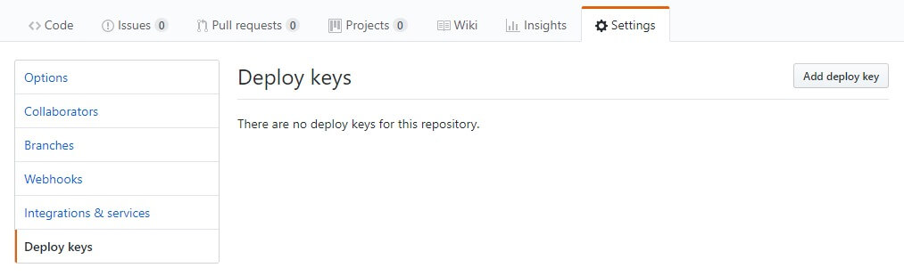
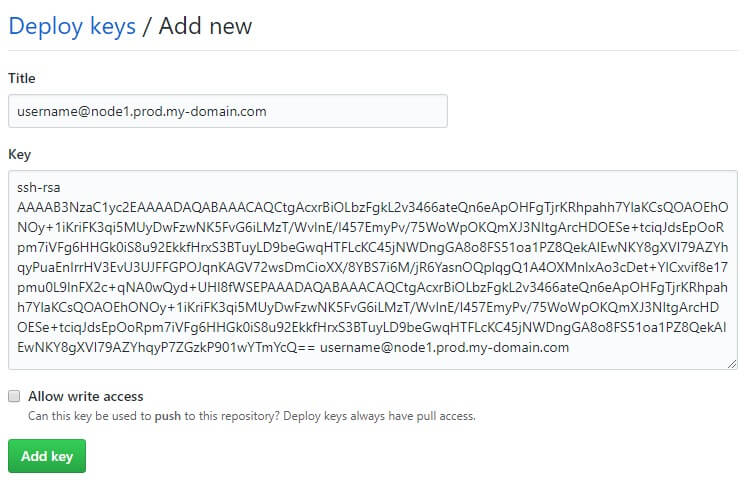
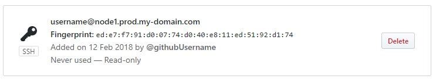

# Add your own application

In this step we'll add your own application, that is stored in Github or any other Git solution. The Workflow of adding a deploy SSH key might be different, based on the system you use, but the rest of the process should be similar.

We will not talk about Continuous Integration in this tutorial, as it would go beyond the scope.

## Create a SSH key on the server

As a first step we will create a SSH key on the server, that we will use for pulling code from Github. We use our username and the hostname in the comment section. Press [Enter] for all questions asked and the key will be generated.

As we will use this key for reading from Github only and the code is on our server anyway, this is no security risk. You only have __to ensure__ that the key is __not used for other purposes__.

<pre>
cd ~
ssh-keygen -t rsa -b 4096 -C "<b>{username}</b>@node1.prod.<b>{your domain}</b>"
</pre>

## Add the deploy key to Github

We will add the generated key as "Deploy key" to github, with read-only access, to reduce unnecessary security risks. Go to your github project page, choose the tab "Settings" and click on "Deploy keys" in the sidebar on the left.

Click on the button "Add deploy key" on the top-right and paste your deployment key into the form.

You key will be shown as never used in the list.

## Clone the repository on your server

Let's clone the repository into a new directory named by the domain of the application, like we did for the boilerplate.{your-domain}.

<pre>
git clone {your repository SSH URL} /var/www/node/{application domain}
</pre>

Example:
<pre>
git clone git@github.com:noreading/express-mongoose-boilerplate.git /var/www/node/boilerplate.dominik-hanke.de
</pre>

## Install needed packages &amp; run build commands

Run the package installation:
<pre>
cd /var/www/node/<b>{application domain}</b> &amp;&amp; npm install
</pre>

If your application has additional build / setup scripts, run them now. And if you have to set environment variables, this is again the right time to do that.

## Add a MongoDB User, if needed

If your application needs a MongoDB database, create a new user used for the connection.

Connect to the Mongo shell:
<pre>
sudo mongo
</pre>

Create the new user:
<pre>
use admin
db.auth('databaseManager', '<b>{your db admin password}</b>')

use <b>{app database name}</b>
db.createUser(
  {
    user: "<b>{app database username}</b>",
    pwd: "<b>{app database password}</b>",
    roles: [ { role: "readWrite", db: "<b>{app database name}</b>" } ]
  }
);
</pre>

## Add a new nginx host

Copy the template from the starter files:
<pre>
sudo cp ~/simple-node-server/starter-files/nginx/application.conf /etc/nginx/conf.d/<b>{application domain}</b>.conf
</pre>

Open the new configuration with <a href="https://github.com/noreading/simple-node-server#basic-nano-commands" target="_blank">nano</a>:
<pre>
sudo nano /etc/nginx/conf.d/<b>{application domain}</b>.conf
</pre>

Update the following lines and replace the the application domain and the port used, but __do not__ remove the #hashes in front of the 3 SSL lines now:
<pre>
server {
    ...
    server_name <b>{application domain}</b>;
    ...
}

server {
    ...
    server_name <b>{application domain}</b>;

  #ssl_certificate /etc/letsencrypt/live/<b>{application domain}</b>/fullchain.pem;
  #ssl_certificate_key /etc/letsencrypt/live/<b>{application domain}</b>/privkey.pem;
  #ssl_trusted_certificate /etc/letsencrypt/live/<b>{application domain}</b>/fullchain.pem;
    ...
    access_log /var/log/nginx/<b>{application domain}</b>-access.log;
    error_log /var/log/nginx/</b>{application domain}</b>-error.log;
    ...
    location / {
        proxy_pass http://localhost:<b>{application port}</b>;
        ...
    }
}
</pre>

Update the following line and replace the port number with the one you want to use for your application. Each application needs to run on a seperate port.
<pre>
proxy_pass http://localhost:7000;
</pre>

Check if the configuration is working:
<pre>
sudo service nginx configtest
</pre>

The result should look like this:
<pre>
nginx: the configuration file /etc/nginx/nginx.conf syntax is ok
nginx: configuration file /etc/nginx/nginx.conf test is successful
</pre>

If it doesn't, please check if you missed a semicolon or broke something during copy &amp; paste.

When everything is fine, restart the nginx server:
<pre>
sudo service nginx restart
</pre>

## Generate a Let's Encrypt certificate

Now, that we've prepared the nginx configuration, we're able to request a new certificate for our application domain:
<pre>
sudo certbot certonly --webroot --agree-tos --no-eff-email --email <b>{your email}</b> -w /var/www/letsencrypt -d <b>{application domain}</b>
</pre>

The result should look like this:
<pre>
Saving debug log to /var/log/letsencrypt/letsencrypt.log
Plugins selected: Authenticator webroot, Installer None
Starting new HTTPS connection (1): acme-v01.api.letsencrypt.org
Obtaining a new certificate
Performing the following challenges:
http-01 challenge for boilerplate.your-domain.com
Using the webroot path /var/www/letsencrypt for all unmatched domains.
Waiting for verification...
Cleaning up challenges

IMPORTANT NOTES:
 - Congratulations! Your certificate and chain have been saved at:
   /etc/letsencrypt/live/boilerplate.your-domain.com/fullchain.pem
   Your key file has been saved at:
   /etc/letsencrypt/live/boilerplate.your-domain.com/privkey.pem
   Your cert will expire on 2018-05-11. To obtain a new or tweaked
   version of this certificate in the future, simply run certbot
   again. To non-interactively renew *all* of your certificates, run
   "certbot renew"
 - Your account credentials have been saved in your Certbot
   configuration directory at /etc/letsencrypt. You should make a
   secure backup of this folder now. This configuration directory will
   also contain certificates and private keys obtained by Certbot so
   making regular backups of this folder is ideal.
 - If you like Certbot, please consider supporting our work by:

   Donating to ISRG / Let's Encrypt:   https://letsencrypt.org/donate
   Donating to EFF:                    https://eff.org/donate-le
</pre>

## Activate the certificate

Open the nginx host configuration with <a href="https://github.com/noreading/simple-node-server#basic-nano-commands" target="_blank">nano</a>:
<pre>
sudo nano /etc/nginx/conf.d/<b>{application domain}</b>.conf
</pre>

Update the following lines and remove the #hashes in front of them:
<pre>
server {
    ...
  ssl_certificate /etc/letsencrypt/live/<b>{application domain}</b>/fullchain.pem;
  ssl_certificate_key /etc/letsencrypt/live/<b>{application domain}</b>/privkey.pem;
  ssl_trusted_certificate /etc/letsencrypt/live/<b>{application domain}</b>/fullchain.pem;
    ...
}
</pre>

Restart the nginx server:
<pre>
sudo service nginx restart
</pre>

## Test the setup

To test our setup, we will run the the application manually.

<pre>
cd /var/www/node/<b>{application domain}</b>
node <b>{application starter file}</b>
</pre>

If everything works well and there are no errors in your configurations you should be able to access the application in your browser:

<pre>
https://<b>{application domain}</b>
http://<b>{application domain}</b>
</pre>

## Create a unit file

Copy the unit file from the starter files to systemd services:
<pre>
sudo cp ~/simple-node-server/starter-files/application.service /etc/systemd/system/node-<b>{your domain}</b>.service
</pre>

We have 5 settings that are interesting to change for most applications:

|Setting|Description|
|:------|:----------|
|Description|The description of the service you want to add|
|User|The user used to run the startup script|
|Environment|Environment variables that your application can read|
|WorkingDirectory|The directory in which the application code is stored|
|ExecStart|The command to run to start the application|

Open the new unit file with <a href="https://github.com/noreading/simple-node-server#basic-nano-commands" target="_blank">nano</a> and replace the placeholders:
<pre>
sudo nano /etc/systemd/system/node-<b>{your domain}</b>.service
</pre>
<pre>
Description=<b>{very short application description}</b>
...
WorkingDirectory=/var/www/node/<b>{application domain}</b>
ExecStart=/usr/bin/node <b>{application start script}</b>
Restart=always
RestartSec=500ms
StartLimitInterval=0

[Install]
WantedBy=multi-user.target
</pre>

## Test the new service

Let's try to run our new service:
<pre>
sudo systemctl start node-<b>{application domain}</b>
</pre>

Verify that it's running:
<pre>
sudo systemctl status node-<b>{application domain}</b>
</pre>

## Run the service on boot

When everything worked, we can add the service to the system boot so that it's started automatically every time the server is booting.

<pre>
sudo systemctl enable node-<b>{application domain}</b>
</pre>

---
__Next:__ [Recurrent management tasks](./recurrent-management-tasks.md)
