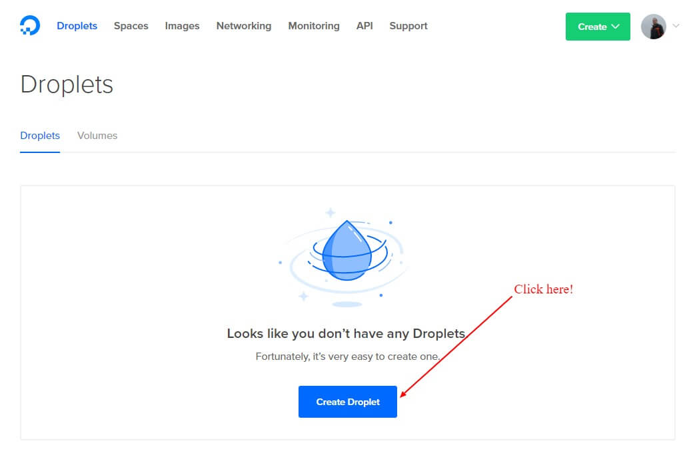
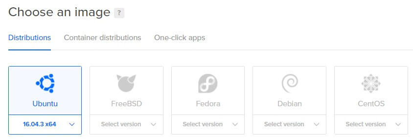
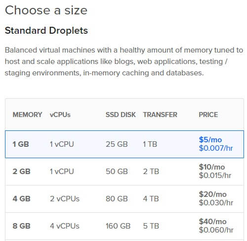
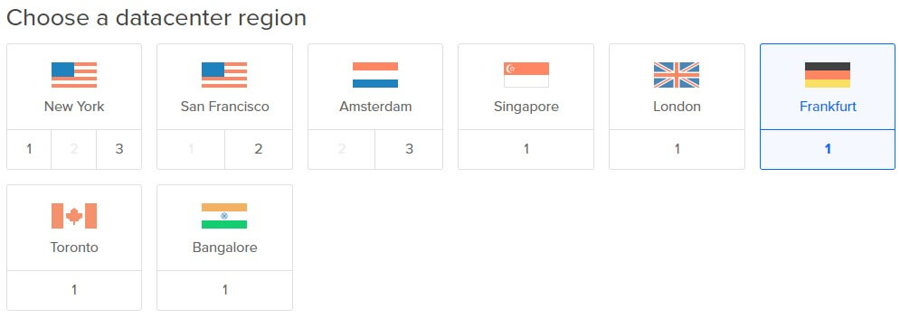
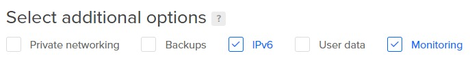
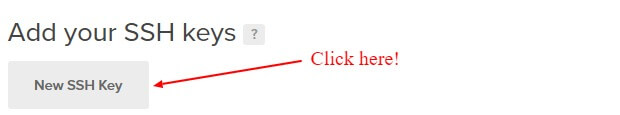
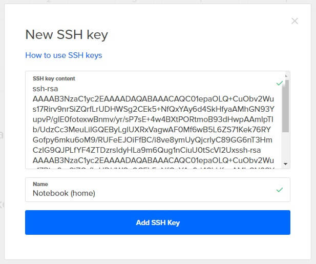
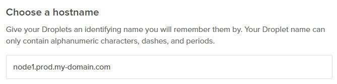
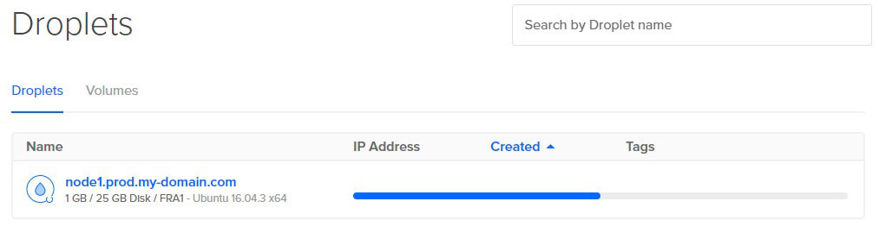

# Create your first droplet

We will setup your first cloud-based server in this step and show you which settings should be chosen as a beginner. Please keep in mind that you can always upgrade your server, if you really need it, so don't book a big one just "to be sure" now.

## Click the button

Go to the [Droplet management](https://cloud.digitalocean.com/droplets) page and click the big blue button.

## Choose an image

Choose "Ubuntu 16.04 x64" as this is a common image to run production servers and the tutorial is based on this version. Some commands or packages may differ in other versions.

## Choose a size

The smallest standard droplet is enough to host multiple Node.js applications if they don't have thousands of requests at the same time. Of course it's also important how much memory the applications consume, but for the first steps 1 GB of RAM should be enough.

## Choose a datacenter region

DigitalOcean offers different locations for their droplets. You should choose a server close to your location, to get fast access and good speed for your users. If most of your users are located in another country, it could be an option to start your machine there.

## Select additional options

I suggest to activate the two (free) additional options "IPv6" and "Monitoring" to get the most out of your machine. We have to install an additional software package for the advanced monitoring later, so please don't skip that step if you select this option now.

## Add your SSH key

To be able to securely login into the new server that you create you should add your SSH key. If you don't add your SSH key the droplet will be accessible with a generated password and bots or hackers could try to brute-force your root account.

Add your public SSH key.

## Choose a hostname

You should use a name that is self-explanatory and reminds you what the server is used for and if it is running for production, development, staging, etc.

I like to group my servers like this:

<pre>
# Node.js
node1.prod.my-domain.com
node1.dev.my-domain.com

# Nginx
web1.prod.my-domain.com
</pre>

If a server is used for multiple things, I would not suggest to add all of its features to the name. You could use the name of the application instead.  
<pre>
portfolio.prod.my-domain.com
</pre>

## Start the process

Click the big, green "Create" button to start the process of creating the droplet.  
The droplet building process will be shown.

## Set DNS records

You need to set the DNS records for your domain, to match the used hostname and the demo project of this tutorial. If you're not managing the DNS settings of your domain on DigitalOcean or in a domain management system yourself, ask your administrator.

Add needed __A__ and __AAA__ records to your DNS settings:
<pre>
node1.prod.<b>{your domain}</b>   <b>{server ip address}</b>
boilerplate<b>{your domain}</b>   <b>{server ip address}</b>
</pre>

In some DNS administration panels the main entry is not "*.{your-domain}" but just "@". Please read the instructions of your domain provider carefully.

---
__Next:__ [Add a new user](./add-a-new-user.md)
